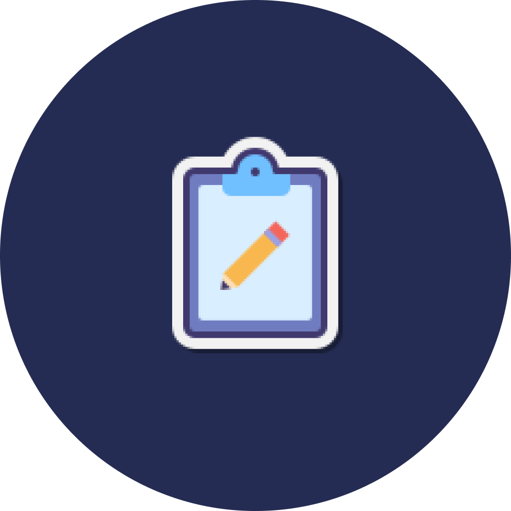
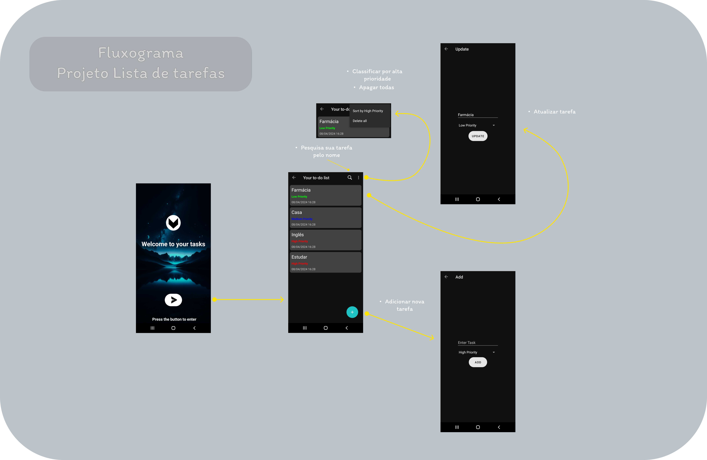

 [![LinkedIn][linkedin-shield]][linkedin-url]

 

  

  <h3 align="center">Hello Tasks</h3>

  

    Projeto para voçê anotar suas tarefas do dia-dia
     
  

<!-- TABLE OF CONTENTS -->

  
Table of Contents

  <ol>
    <li>
      <a href="#about-the-project">About The Project</a>
        <li><a href="#built-with">Built With</a></li>
      </ul>
    </li>
      </ul>
    </li>
    <li><a href="#contributing">Contributing</a></li>
    <li><a href="#contact">Contact</a></li>
  </ol>

<!-- ABOUT THE PROJECT -->
## About The Project

 

---
 Este aplicativo, desenvolvido em Kotlin, oferece uma maneira eficiente e direta de gerenciar tarefas diárias. Com uma interface intuitiva, os usuários podem facilmente adicionar, priorizar e organizar suas obrigações.

- Gerenciamento de Tarefas: Atualize detalhes ou exclua-as conforme necessário.

- Ordenação por Prioridade: Organize as tarefas em ordem decrescente de prioridade para se concentrar no que é mais importante.

- Exclusão de Tarefas: Remova tarefas individuais ou limpe sua lista excluindo todas de uma vez.

- Persistência de Dados: Os dados são salvos e gerenciados dentro do App Inspection do Android Studio, garantindo uma recuperação fácil para depuração e testes.

(<a href="#readme-top">back to top</a>)

### Built With

<!-- CONTRIBUTING -->
## Contributing

Contribuições são bem-vindas! Este projeto é um ponto de partida excelente para aqueles que desejam praticar Kotlin ou contribuir para um aplicativo com funcionalidade real.

Fique a vontade para clonar e modificar!

(<a href="#readme-top">back to top</a>)

<!-- CONTACT -->
## Contact

Email: geisonbruno0@gmail.com

(<a href="#readme-top">back to top</a>)

[contributors-url]: https://github.com/geisonbruno1/To-do-list/graphs/contributors
[stars-shield]: https://img.shields.io/github/stars/othneildrew/Best-README-Template.svg?style=for-the-badge
[stars-url]: https://github.com/geisonbruno1/To-do-list/stargazers
[issues-shield]: https://img.shields.io/github/issues/othneildrew/Best-README-Template.svg?style=for-the-badge
[issues-url]: https://github.com/othneildrew/Best-README-Template/issues
[linkedin-shield]: https://img.shields.io/badge/-LinkedIn-black.svg?style=for-the-badge&logo=linkedin&colorB=555
[linkedin-url]: https://www.linkedin.com/in/geison-bruno-ab4079224/
[product-screenshot]: images/screenshot.png
[Svelte.dev]: https://img.shields.io/badge/Svelte-4A4A55?style=for-the-badge&logo=svelte&logoColor=FF3E00
[Svelte-url]: https://svelte.dev/
[Bootstrap.com]: https://img.shields.io/badge/Bootstrap-563D7C?style=for-the-badge&logo=bootstrap&logoColor=white
[Bootstrap-url]: https://getbootstrap.com
[JQuery.com]: https://img.shields.io/badge/jQuery-0769AD?style=for-the-badge&logo=jquery&logoColor=white
[JQuery-url]: https://jquery.com 
